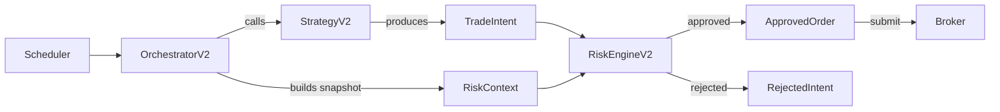
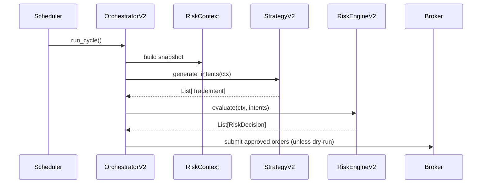
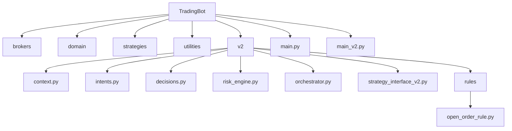
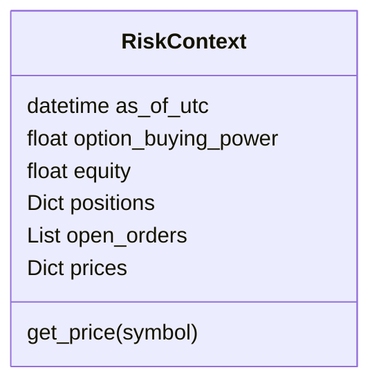
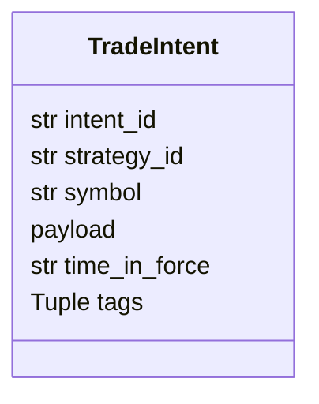
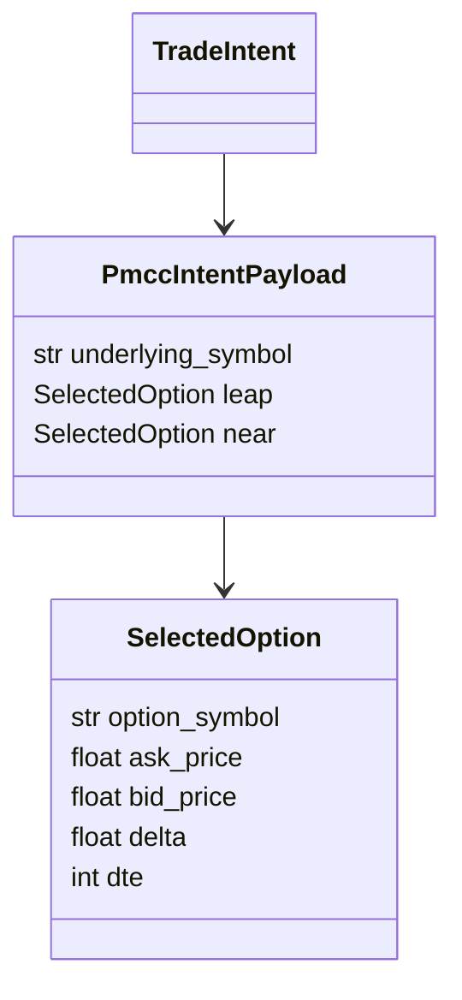
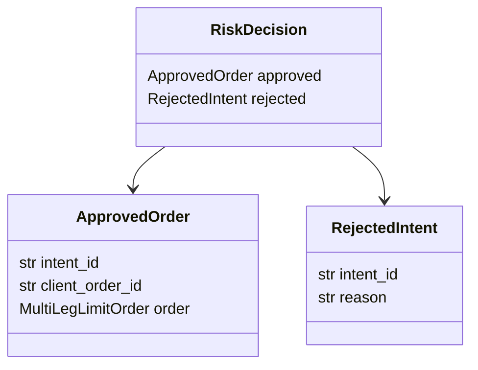
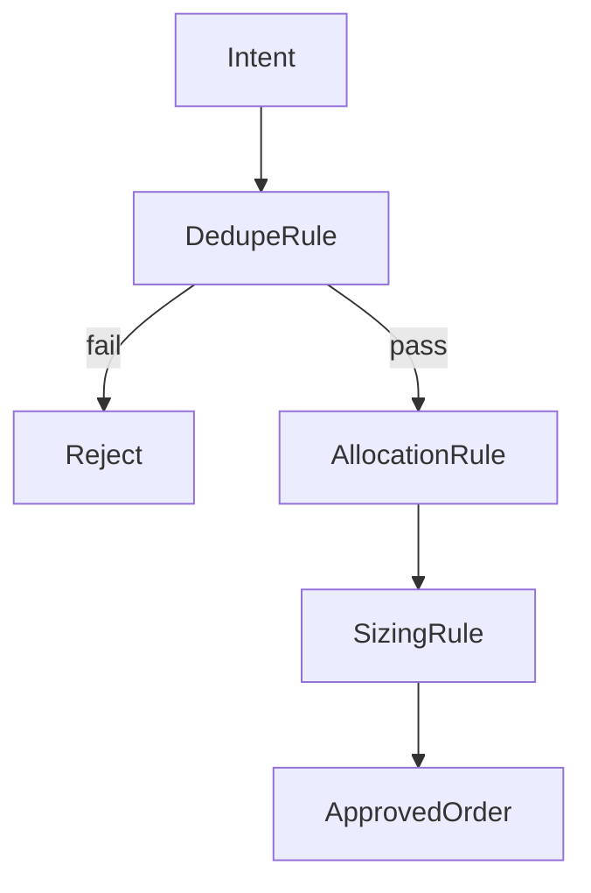
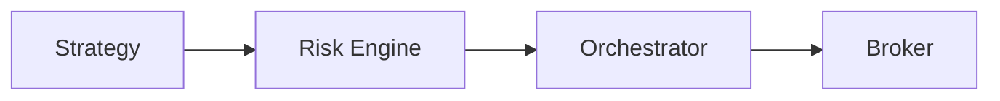

# TradingBot V2 – Option C architecture

This document explains, end-to-end, how TradingBot V2 (Option C) works.

It covers:

* architectural philosophy
* control flow
* folder and file responsibilities
* data contracts between components
* how risk controls capital
* where strategies stop and risk begins

This is a design contract, not just documentation.

---

## 1. Core philosophy

TradingBot V2 follows a request -> evaluate -> execute model.

* Strategies request trades
* Risk decides if they are allowed and how large
* Orchestrator executes approved orders

### Hard rules

* Strategies never size positions
* Strategies never submit orders
* Strategies never query account state directly
* Risk is the single authority on capital allocation

If any of the above is violated, the programme has failed.

---

## 2. High-level system overview

---

## 3. Runtime control flow (one cycle)

---

## 4. Folder structure and responsibilities

---

## 5. Core data contracts

### 5.1 RiskContext

Purpose:

* Immutable snapshot of account and market state
* Built once per orchestration cycle
* Shared read-only across strategies and risk

---

### 5.2 TradeIntent

TradeIntent represents desire, not permission.

---

### 5.3 Strategy-specific payload (PMCC example)

---

### 5.4 RiskDecision

---

## 6. Risk engine responsibilities

---

## 7. Orchestrator responsibilities

The orchestrator:

* does not make trading decisions
* does not size trades
* does not contain strategy logic

Responsibilities:

1. Build RiskContext snapshot
2. Collect TradeIntents
3. Request RiskDecisions
4. Submit ApprovedOrders (or log in dry-run)

---

## 8. Strategy responsibilities (V2)

Strategies may:

* analyse markets
* select instruments
* express intent

Strategies may not:

* access capital
* submit orders
* decide risk

---

## 9. Comparison with V1

| Aspect           | V1         | V2 (Option C)     |
| ---------------- | ---------- | ----------------- |
| Position sizing  | Strategy   | Risk engine       |
| Capital limits   | Strategy   | Centralised       |
| Broker access    | Everywhere | Orchestrator only |
| Risk consistency | Fragmented | Guaranteed        |
| Auditability     | Low        | High              |

---

## 10. Mental model

---

## 11. Current implementation status

| Component          | Status   |
| ------------------ | -------- |
| V2 scaffolding     | complete |
| Data contracts     | complete |
| Deduplication rule | complete |
| Allocation policy  | pending  |
| Sizing logic       | pending  |
| Order submission   | pending  |
| Dry-run mode       | next     |

---

## 12. Key invariant

There must be no code path where a strategy can trade without passing through the risk engine.
